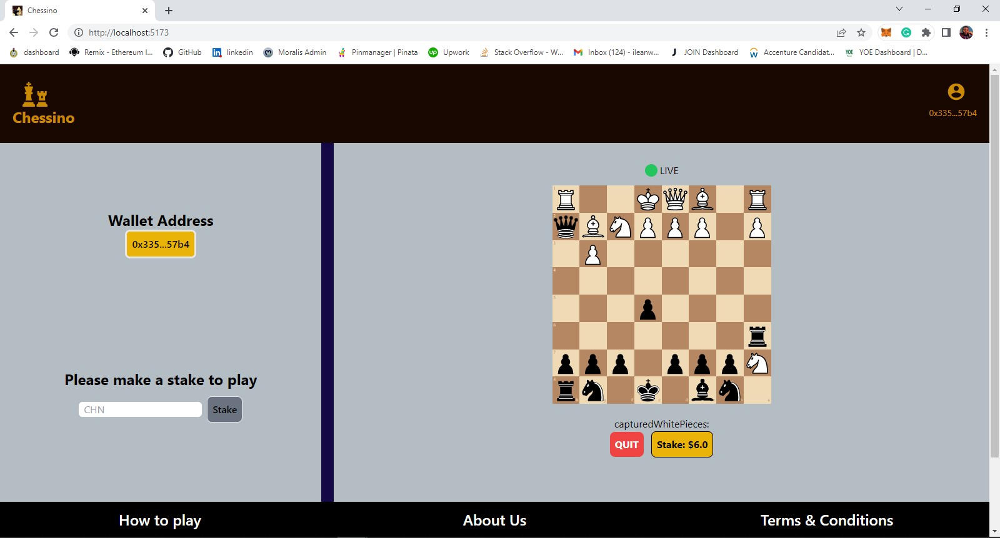
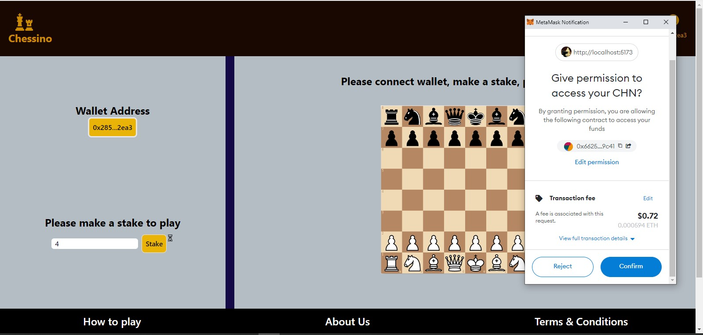
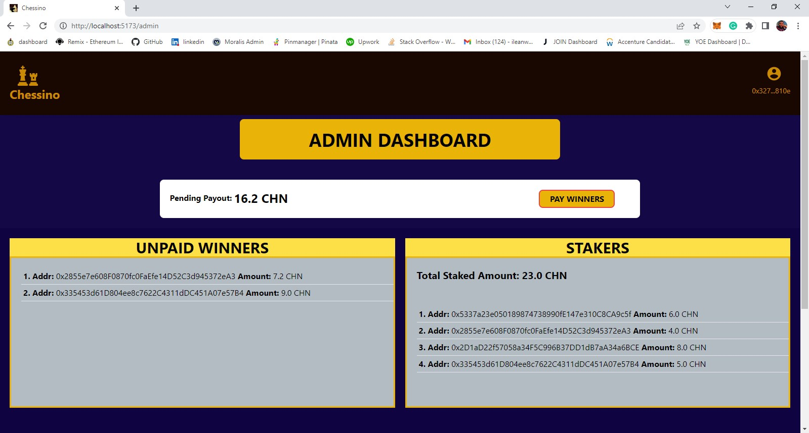
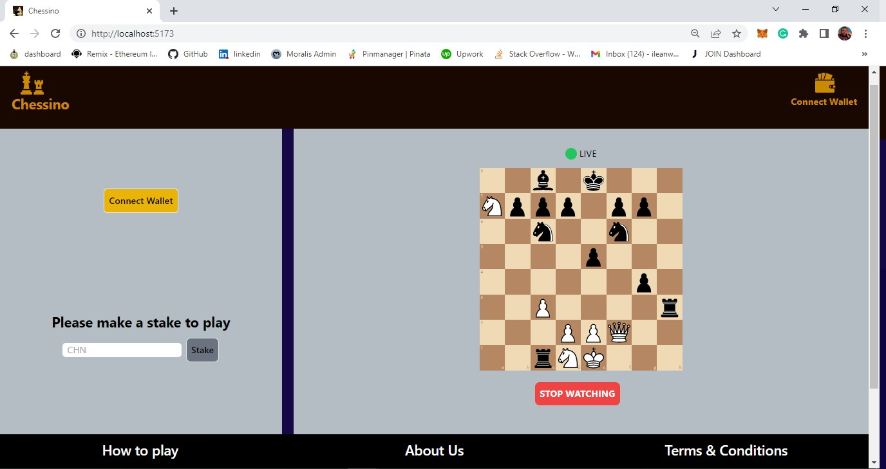

# CHESSINO - Web3 Chess gaming Platform

## Polygon Hackathon Africa 2022 (Beginner Track) Project

#

#

# Brief Description

This is a web3 chess gaming platform where users connect their digital crypto wallets, stake CHN ERC20 token (CHN is the ERC20 token created for the gaming platform) and play a chess game to win rewards. Users can also stream live chess game happening on the platform. Users make stakes using the CHN ERC20 token we have created for the platform, and when a user wins a game, the user is rewarded with the same CHN ERC20 token.

#

# Tech Stack and Tools Used

1. Solidity
2. Truffle
3. ethers.js
4. TypeScript
5. React.js
6. Firebase database

#

# Links

The smart contracts have been deployed to the polygon mumbai testnet

1. CHN ERC20 Token Contract Address:
   0x3h343hh6hl45h7h4g2ug452k456hkhkhi4](0x3h343hh6hl45h7h4g2ug452k456hkhkhi4)
2. Chessino Contract Address:
   [0x3h343hh6hl45h7h4g2ug452k456hkhkhi4](0x3h343hh6hl45h7h4g2ug452k456hkhkhi4)
3. Website deployment of frontend:
   [https://chessino.netlify.app/](https://chessino.netlify.app/)

#

## How To Use The Platform:

1. Connect ethereum wallet

2. Make a stake using CHN ERC20 token deployed on Polygon Mumbai Testnet

3. Create a new chess game or Join a new chess game

4. Stream a live chess game

#

# Project Structure

The project contains two folders

1. smart-contracts
2. frontend

### smart-contracts

The folder contains two (2) smart contracts and one (1) interface solidity file

1. CHN.sol - This is the ERC20 token smart contract that is used for staking and for rewarding winners of a game.
2. Chessino.sol - This is the platform processor contract. It manages core operations of the platform such as making a stake, setting a winner, paying winners etc.

### frontend

This is the folder containing files for the game play, it contains

#

## Making a stake using CHN ERC20 Token

#

## Admin Dashboard

#

## Streaming a live game

#

## Truffle test result

