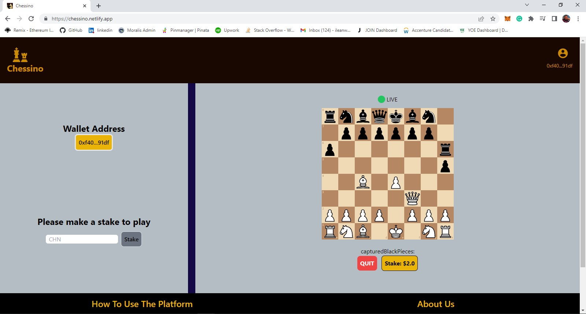
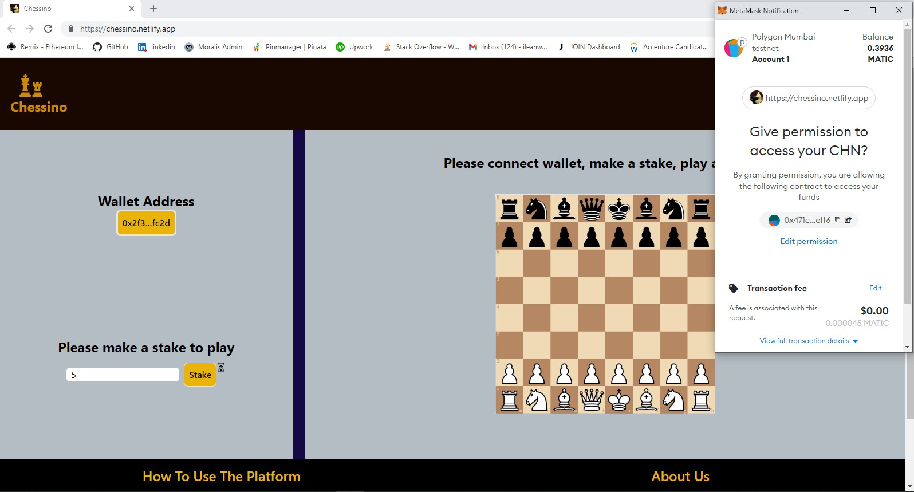
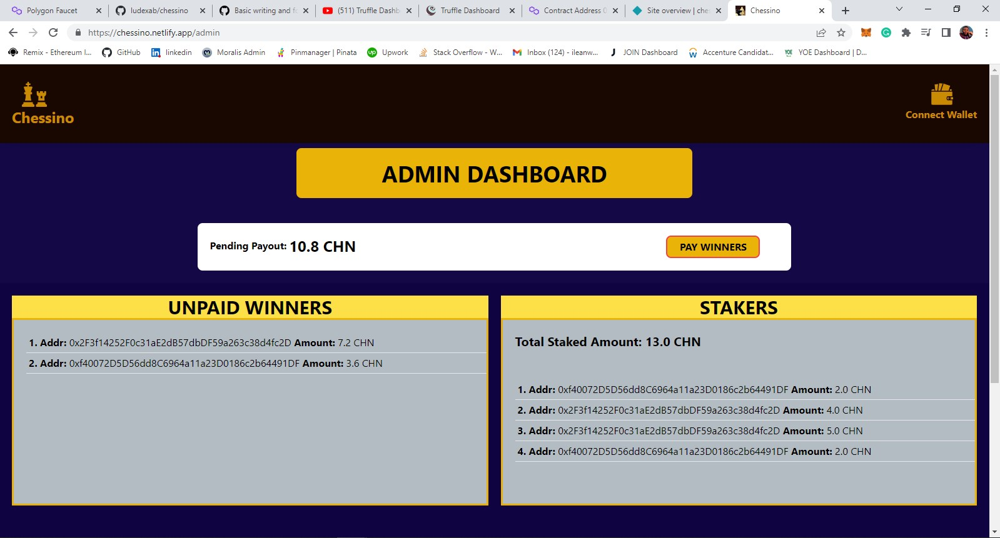
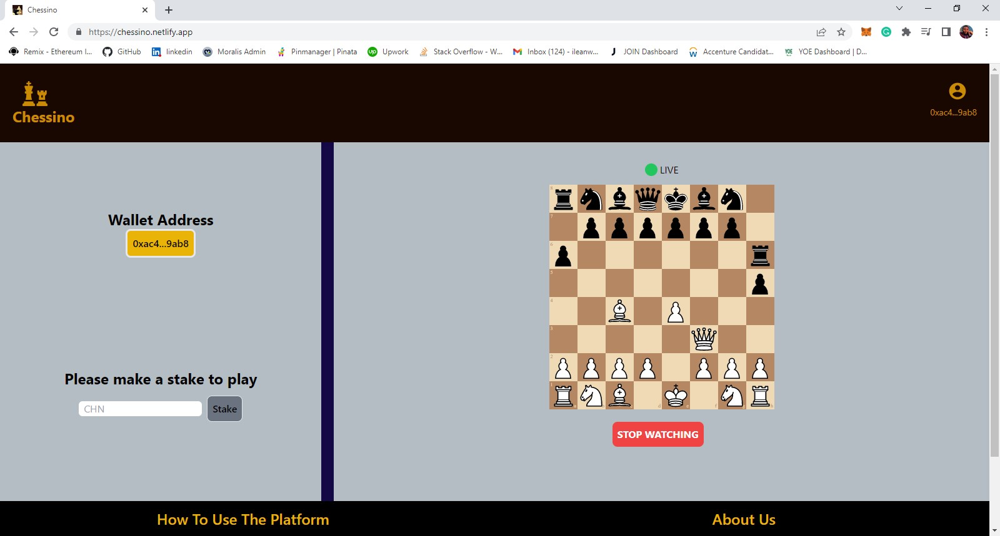

# CHESSINO - Web3 chess gaming and streaming platform

## Polygon Hackathon Africa 2022 (Beginner Track) Project

#

#

# Description Of Project

This is a web3 chess gaming and streaming platform where users play a game of chess against another user to win a reward. Users stake CHN ERC20 token to create a new chess game and/or join a new chess game. CHN is the ERC20 token that is created and deployed on the Polygon Mumbai Testnet for use on the platform. Users make stakes using CHN token and are rewarded in CHN token.

######

Users may also stream a live chess game happening on the platform. However, users do not need to stake to stream a live chess game for now.
When a chess game is played and there is a winner, a routine payout is triggered and the winners are paid their winnings.
A winner is paid 90% of double their stake on a game.
For example, if a user stakes 5CHN and wins, he is paid 9CHN as reward. I.e 90% of (5 \* 2)

######

N.B Please note that this project has been developed as a prototype, therefore it is still limited in some scalability features. For example, only one live chess game can be played at a time on the platform. Subsequent users that login after a chess game is started will automatically be only allowed to stream that live game

#

# Tech Stack and Tools Used

1. Solidity
2. Truffle
3. ethers.js
4. TypeScript
5. React.js
6. Firebase database

#

# Links

The smart contracts have been deployed to the Polygon Mumbai Testnet and the frontend deployed on netlify. The links are given below

1. CHN ERC20 Token Contract Address:
   [0x3h343hh6hl45h7h4g2ug452k456hkhkhi4](0x3h343hh6hl45h7h4g2ug452k456hkhkhi4)
2. Chessino (Game platform processor) Contract Address:
   [0x3h343hh6hl45h7h4g2ug452k456hkhkhi4](0x3h343hh6hl45h7h4g2ug452k456hkhkhi4)
3. Website deployment of frontend:
   [https://chessino.netlify.app/](https://chessino.netlify.app/)

#

# How The Project Works:

To use the Chessino gaming and streaming platform, a user has to follow the following steps:

1. Login to the website at [https://chessino.netlify.app/](https://chessino.netlify.app/)

2. Connect Metamask wallet and switch to the polygon mumbai testnet
   N.B The Metamask wallet address must contain some CHN token or be funded with some CHN ERC20 tokens, this is your staking power.

3. Make a stake using CHN ERC20 token deployed on Polygon Mumbai Testnet.
   To create a new game or join a new game, a user will need to make a stake using the CHN ERC20 token from step 2 above.
   Enter the amount of CHN you wish to stake (minimum stake is 2 CHN) into the field in the middle left position of the screen and click on the stake button.

4. Once the staking is successful,

- if the user is creating a new game, a selection dropdown will appear for user to select the color to play as (either playing as white, or playing as black). Then click on the START button, the game is now in waiting mode, waiting for the second player to begin.
- else if the user is joining a new game, the option to choose player color will not be available. The creator of the current game has advantage of choosing color first. Then click on the START button and the game commences for both players.
- if a new game has been created and the game is in the waiting mode, a user who login into the platform will automatically be joining the new game already created, the new game is now complete and game mode is now live.

N.B Because this application is a prototype, only one game can happen at a particular time. Subsequent users that login to the site will automatically be streaming the current live chess game.

5. To Stream a live chess game, remember from step 4 above that only one (1) game can happen at a time, once a particular chess game is full (i.e white and black players have commenced a game) any user who login onto the website will automatically be streaming the live game at the moment.

- the user does not need to stake to stream a live game, hence the user does not need to connect the metamask wallet to stream.

6. Winning a game. Only a checkmate can result to a win in this gaming platform, if there is a draw, the two players are considered to have lost the game.

7. When a player wins a game, the player is rewarded with a 90% of double the amount staked by that user.

#

# Project Structure

The project contains two folders

1. smart-contracts
2. frontend

### smart-contracts

The folder contains two (2) smart contracts and one (1) interface solidity file

1. CHN.sol - This is the ERC20 token smart contract that is used for staking and for rewarding winners of a game.
2. Chessino.sol - This is the platform processor contract. It manages core operations of the platform such as making a stake, setting a winner, paying winners etc.
3. ICHN.sol - This is the CHN ERC20 token interface solidity file.

### frontend

This is the folder containing files for the game play, it contains files that render an interface for a user to interact with the app.

#

### Making a stake using CHN ERC20 Token

#

### Admin Dashboard

#

### Streaming a live game

#

### Truffle test result

